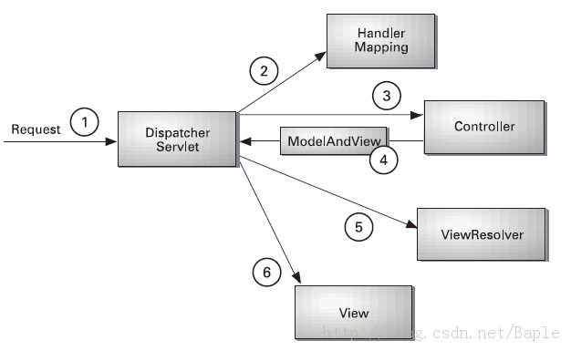

java:spring
===
+ 三个核心组件
	+ core
	+ context(为spring提供运行时环境)
	+ beans(最重要，spring为面向bean编程)

 

+ spring解决的最关键问题：
 	+ 把对象间的依赖关系用配置文件管理（依赖注入）
 	+ 用IoC容器管理，spring通过把对象包裹在bean里实现对象管理

 

+ spring响应流程

 	

##IoC
---
把传统上由程序代码直接操控的对象调用权交给容器，通过容器实现对象的装配和管理

##AOP
---
+ spring对bean对象的AOP处理有两种方式：
	+ 有接口的类：JDKDynamicAopProxy
	+ 普通类：CglibProxyFactory

##Servlet
---
+ servlet是对http协议做面向对象的封装
	+ HttpServletRequest :对应http请求，通过它可以获取请求相关	信息，如url,cookie,请求参数
	+ HttpServletResponse：对应http回应

##session
---
+ 针对http无连接状态，session用来保存用户连接状态信息
+ 本质为服务器端的哈希表

##事务管理
---
###四个特性：
+ 原子性：所有操作一次性做完
+ 一致性：数据不会被破坏
+ 隔离性：并发时，拥有各自空间
+ 持久性：持久化到数据库

###数据并发问题
1. 脏读：B操作->A读->B回滚->A不知道，在原来基础上操作
2. 不可重复读：A读->B操作->A读，与之前读的不一致（更改数据）
3. 幻想读：A读->B新增数据->A读（新增数据）
4. 第一类丢失：A读（1000）->B存入100（1100）->A取100（900）->A撤销（1000）：把B事务的更新数据覆盖
5. 第二类丢失：A读（1000）->B取100（900）->A寸100（1100）：B的操作丢失

###数据库锁机制
+ 表锁and行锁

###事务隔离级别
1. READ UNCOMMITED（最低）
2. READ COMMITED
3. REPEATABLE READ
4. SERIALIZABLE(顺序的，最高级别，最慢)

